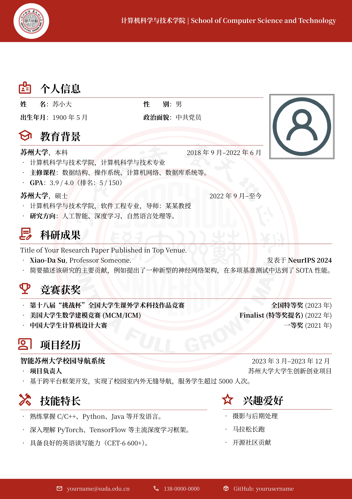

# SUDA-CV：苏州大学 LaTeX 中文简历模板

## 简介

本模板基于：

- [WHU 中文 CV 模板](https://www.overleaf.com/latex/templates/whuwu-han-da-xue-zhong-wen-jian-li-mo-ban/dbkvxrqjmzpd)
- [NPU 中文 CV 模板](https://www.overleaf.com/latex/templates/npu-cv/mncqzxhvfzrx)
- [SEU 中文 CV 模板](https://www.overleaf.com/latex/templates/seu-cv-dong-nan-da-xue-latex-zhong-wen-jian-li-mo-ban/jyzpthvnbmpm)
在原有内容的基础上进行了修改：

- **苏大品牌配色**：采用苏州大学标准色“苏大红”（RGB: 175, 37, 28）。
- **原生视觉元素**：
    - 页眉页脚使用 TikZ 绘制的苏大红背景条。
    - 校徽采用圆形白底装饰，并在页面中心设有低透明度校徽水印。
- **现代化图标系统**：集成 [Material Symbols](https://fonts.google.com/icons) 字体库，提供风格统一且丰富的图标选择。
- **优雅的排版布局**：
    - 支持大尺寸个人照片展示。
    - 使用 `itemize` 和 `minipage` 优化内容展示空间。
    - 预设了个人信息、教育背景、科研成果、竞赛获奖、项目经历等常用模块。
- **高品质字体**：内置 `Noto Serif SC` 衬线中文字体，确保在不同平台下的显示效果一致。

## 项目结构

- `main.tex`: 简历主文件，个人信息及简历内容在此修改。
- `figs/`: 存放校徽（suda_logo.pdf）等矢量素材。
- `fonts/`: 存放项目所需的 Noto Serif SC 及 Material Symbols 字体。
- `images/`: 存放头像（avatar.png）等位图资源。
- `material-symbols.sty`: 图标宏包定义。

## 使用方法

1. **环境准备**：建议安装完整版的 TeX Live 或 MikTeX。
2. **内容修改**：打开 `main.tex`，根据注释提示修改个人信息及简历内容。
3. **编译生成**：使用 **XeLaTeX** 引擎进行编译。

## 致谢

本模板在开发过程中参考了以下项目：
- [SEU 中文 CV 模板](https://github.com/Exception0x0194/SEU-CV)
- [SUDA Beamer Theme](https://github.com/hushidong/SUDA-Beamer-Theme)

